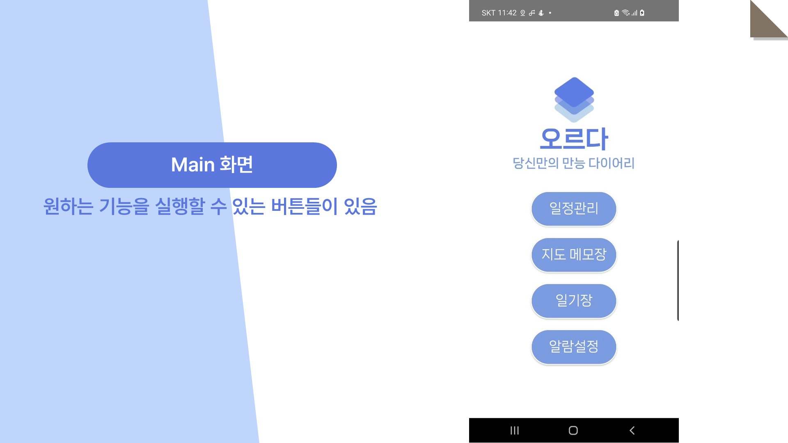

# 당신만의 만능 다이어리, 오르다
### [2022-2 모바일 프로그래밍 최종 기말 프로젝트 3조 - 정유진, 박근영]

   
  
   

## :blue_book: 프로젝트 주제
- 만능 다이어리, 오르다 (ALL THINGS of DIARY)
- 3조 멤버들이 평소에 필요로 하는 기능을 모두 담은 만능 다이어리
- 일정관리, 일기장, 알람 등의 기능을 제공
    

## :blue_heart: 팀 구성

|    |  | 
| :--------: | :--------: |
|   [정유진](https://github.com/yujin45)   |   [박근영](https://github.com/okchangheeok)    |  
| 팀장, 안드로이드 개발 | 안드로이드 개발 | 

  
  
## 📅 개발 기간
2022.12.10 ~ 2022.12.19 (2022년 2학기 기말)

    
  
## 🔧 기술 스택
### Frontend

  
  

    
  
## :star: 상세 설명 및 구현 내용

